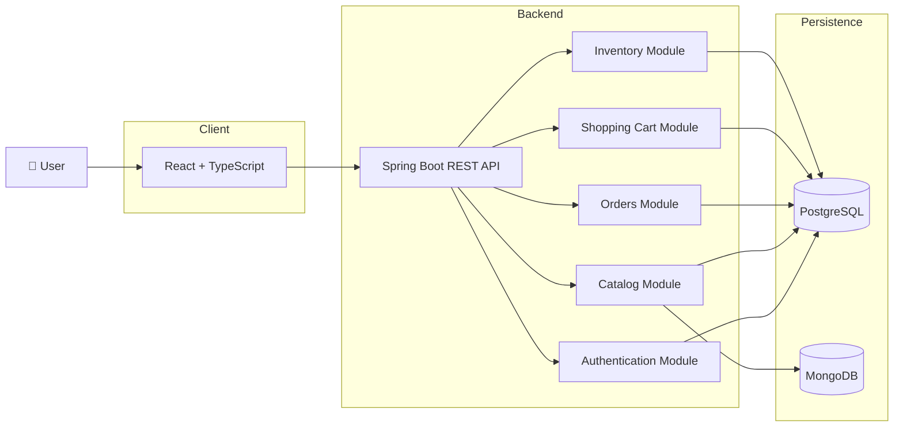
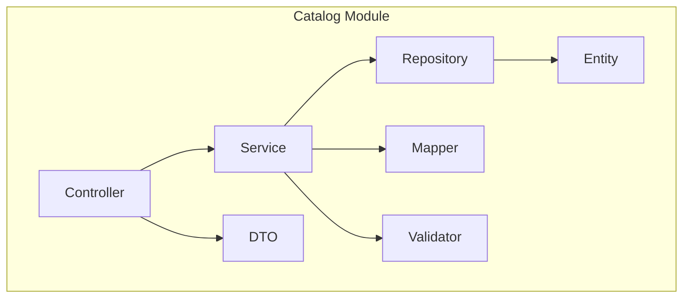
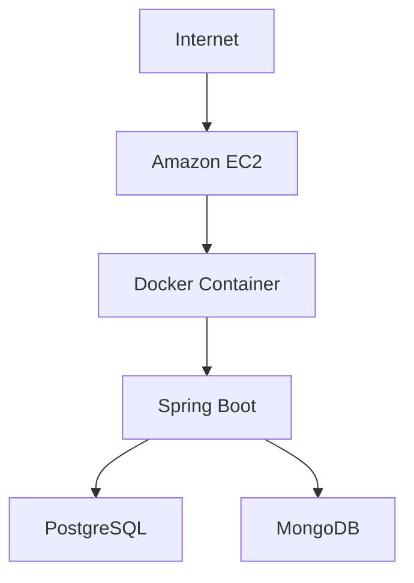
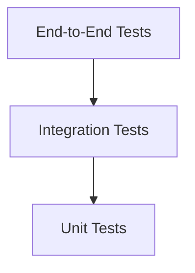

# 001 - System Design

> Status: Draft
>
> Sprint: 01
>
> Last Updated: 2026-07-10

---

# Purpose

This document defines the technical architecture of NovaCommerce.

While the Domain Model describes the business capabilities of the platform, this document explains how those capabilities are implemented from a software engineering perspective.

It serves as the technical blueprint for the entire Engineering Program and documents the architectural decisions that guide the evolution of the platform from a modular monolith into a cloud-native ecosystem.

---

# Architecture Goals

NovaCommerce is designed around the following engineering goals.

- Build a production-ready application.
- Maintain a modular architecture.
- Ensure scalability.
- Enable cloud-native evolution.
- Automate infrastructure provisioning.
- Automate testing and deployments.
- Maximize maintainability.
- Minimize coupling between business domains.
- Promote observability and reliability.

---

# Architectural Principles

Every engineering decision throughout the project should follow these principles.

## Software Engineering

- Clean Code
- SOLID
- DRY
- KISS
- YAGNI

---

## Architecture

- Modular Monolith First
- Domain-Driven Design (DDD)
- Separation of Concerns
- API First
- Infrastructure as Code
- Twelve-Factor App
- Cloud Native Ready

---

## DevOps

- GitFlow
- Conventional Commits
- Pull Requests
- CI/CD
- Automated Testing
- Immutable Infrastructure

---

# High-Level Architecture

The following diagram represents the initial technical architecture implemented during Sprint 1.




Although Sprint 1 is implemented as a modular monolith, the architecture has been intentionally designed to allow each business module to evolve into an independent microservice in future iterations.

---

# Backend Architecture

The backend is implemented using a modular monolith architecture.

Each business domain is organized as an independent module with clearly defined responsibilities.


Each module contains:

- Controller
- Service
- Repository
- Entity
- DTO
- Mapper
- Validator
- Exception Handling
- Tests

This organization minimizes coupling while facilitating the future extraction of microservices.

---

# Frontend Architecture

The frontend is implemented using React and follows a feature-based architecture.

```text
src/

app/

features/

components/

layouts/

pages/

services/

router/

hooks/

shared/

styles/
```

Each feature owns its components, services, pages, hooks, and tests.

The frontend communicates exclusively through the REST API.

---

# Data Architecture

Sprint 1 uses two persistence technologies.

## PostgreSQL

Stores transactional business data.

Examples:

- Users
- Orders
- Products
- Categories
- Inventory

---

## MongoDB

Stores semi-structured information.

Examples:

- Logs
- Product metadata
- Future AI documents

The persistence layer is abstracted to simplify future migrations toward Amazon RDS and DynamoDB.

---

# API Design

NovaCommerce exposes a RESTful API.

The API follows these principles.

- Resource-oriented URLs
- HTTP Status Codes
- Stateless Communication
- OpenAPI Documentation
- DTO Separation
- Validation
- Global Exception Handling

The API is documented using Swagger/OpenAPI.

---

# Security Architecture

Authentication and authorization are centralized.

Sprint 1 includes:

- Spring Security
- JWT Authentication
- Role-Based Access Control (RBAC)
- Password Encryption
- Request Validation

Future sprints will incorporate:

- OAuth2
- Identity Provider Integration
- Fine-Grained Authorization

---

# Infrastructure Architecture

Infrastructure is provisioned exclusively through Terraform.

The initial AWS deployment consists of:

- VPC
- Public Subnet
- Private Subnet
- Security Groups
- IAM Roles
- EC2 Instance



All cloud resources are temporary and must be destroyed after each Engineering Sprint to optimize AWS credit consumption.

---

# Containerization

Every application component is containerized.

Sprint 1 includes:

- Docker
- Docker Compose

Containers provide consistency across:

- Local Development
- Testing
- Continuous Integration
- AWS Deployment

---

# DevOps Architecture

The project adopts a GitOps-oriented workflow.


The CI pipeline performs:

- Build
- Unit Tests
- Static Analysis
- Code Coverage
- Docker Build

Future pipelines will also include:

- Terraform Validation
- Infrastructure Deployment
- Kubernetes Deployment
- Security Scanning

---

# Observability

Application observability evolves during the Engineering Program.

Sprint 1 includes:

- Structured Logging
- Spring Boot Actuator
- Health Checks

Future sprints introduce:

- Metrics
- Distributed Tracing
- Centralized Logging
- Dashboards
- Alerts

---

# Quality Strategy

Every commit should satisfy the following quality gates.

- Unit Tests
- Integration Tests
- SonarCloud
- JaCoCo
- SpotBugs
- Checkstyle

Coverage targets will increase progressively throughout the program.

---

# Testing Strategy

NovaCommerce adopts a testing pyramid.



Sprint 1 includes:

- JUnit
- Mockito
- Selenium
- Playwright

Future sprints will include:

- Performance Testing
- Chaos Engineering
- Contract Testing

---

# Deployment Strategy

Sprint 1 deployment target:

- Amazon EC2

Future deployment evolution:

| Sprint | Target |
|---------|--------|
| 1 | EC2 |
| 2 | Auto Scaling |
| 3 | Serverless |
| 4 | Microservices |
| 5 | Event-Driven |
| 6 | Kubernetes |
| 7 | Multi-Region |
| 8 | AI Platform |
| 9 | Analytics Platform |
| 10 | Internal Developer Platform |

---

# Technology Stack

| Layer | Technology |
|---------|------------|
| Frontend | React + TypeScript |
| Backend | Java 21 + Spring Boot |
| SQL Database | PostgreSQL |
| NoSQL Database | MongoDB |
| Infrastructure | Terraform |
| Containers | Docker |
| CI/CD | GitHub Actions |
| Testing | JUnit, Selenium, Playwright |
| Quality | SonarCloud |

---

# Architectural Decision Records

Major architectural decisions are documented separately using Architectural Decision Records (ADRs).

Each ADR captures:

- Context
- Decision
- Alternatives
- Consequences

This allows architectural decisions to remain traceable throughout the evolution of the platform.

---

# Future Evolution

NovaCommerce has been intentionally designed to evolve incrementally.

The architectural roadmap includes:

- Modular Monolith
- Microservices
- Event-Driven Architecture
- Kubernetes
- Serverless Computing
- Artificial Intelligence
- Analytics Platform
- Internal Developer Platform

Each Engineering Sprint introduces new architectural capabilities while preserving the stability of previous iterations.

---

# Related Documents

- 002-domain-model.md
- ENGINEERING_PROGRAM.md
- sprint-01.md