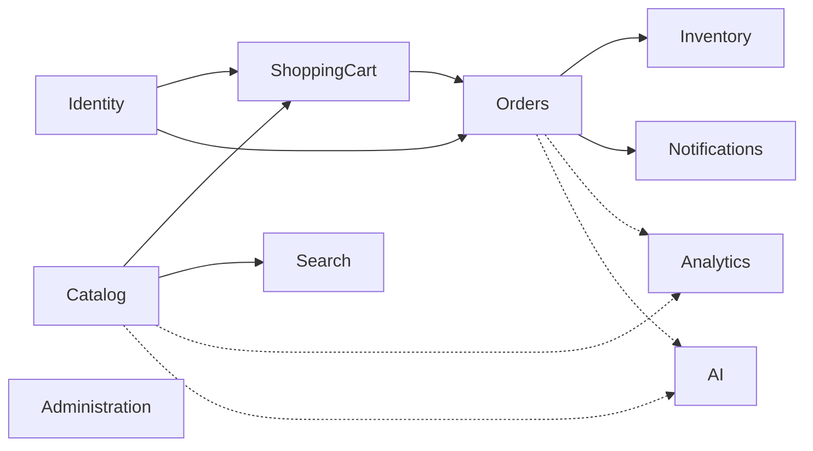
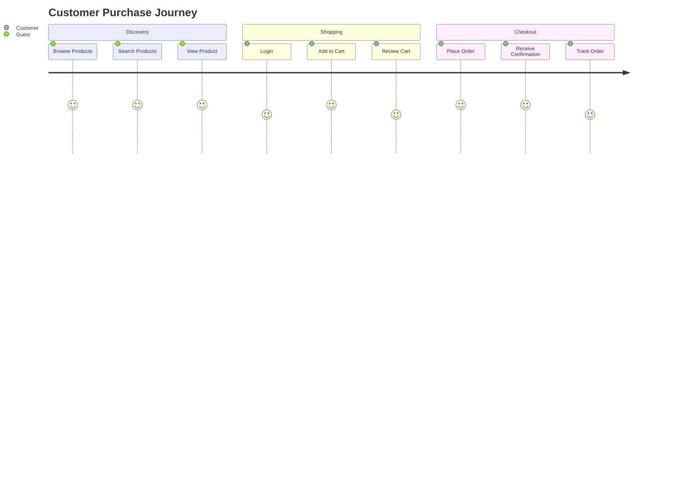
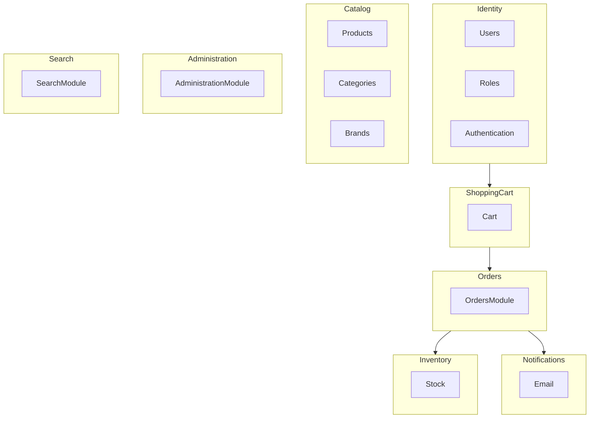
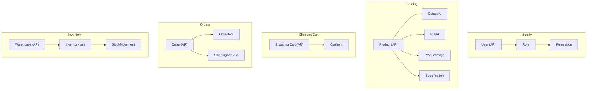
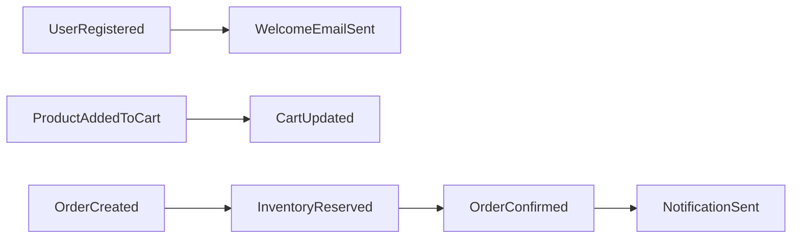

# 002 - Domain Model

> Status: Draft
>
> Sprint: 01
>
> Last Updated: 2026-07-10

---

# Purpose

This document defines the business domain of NovaCommerce.

Instead of focusing on implementation details, this document describes the business capabilities, bounded contexts, entities, relationships, and business events that drive the architecture of the platform.

The goal is to establish a domain model that can evolve naturally from a modular monolith into a cloud-native microservices architecture without major redesign.

---

# Business Vision

NovaCommerce is a technology-focused e-commerce platform designed to provide a modern purchasing experience for customers while offering powerful management capabilities for administrators.

The platform is intentionally designed to evolve over multiple engineering sprints, progressively incorporating cloud-native services, event-driven communication, artificial intelligence, and platform engineering practices.

Although the first release will be implemented as a modular monolith, every business domain should remain independent enough to become an autonomous service in future iterations.

---

# Business Goals

The platform should allow customers to:

- Browse products.
- Search products.
- Compare products.
- Manage a shopping cart.
- Place orders.
- Track orders.
- Receive notifications.
- Interact with AI assistants.

The platform should allow administrators to:

- Manage products.
- Manage inventory.
- Manage categories.
- Manage customers.
- Manage orders.
- Generate reports.
- Monitor business metrics.

---

# Domain Classification

NovaCommerce domains are divided into three categories.

## Core Domains

These domains represent the core business capabilities.

- Catalog
- Orders
- Inventory
- Shopping Cart

---

## Supporting Domains

These domains support the core business.

- Authentication
- Identity
- Notifications
- Administration
- Search

---

## Generic Domains

These domains provide technical capabilities.

- Logging
- Monitoring
- Configuration
- Audit
- Documentation

---

# Future Domains

The following domains will be progressively introduced during later Engineering Sprints.

## AI

Status

Planned (Sprint 8)

Capabilities

- Customer Assistant
- Support Assistant
- Catalog Assistant
- Recommendation Engine
- Retrieval-Augmented Generation (RAG)
- Prompt Management
- AI Observability

---

## Analytics

Status

Planned (Sprint 9)

Capabilities

- Sales Dashboard
- Customer Analytics
- Product Analytics
- KPI Reporting
- Predictive Analytics

---

# Actors

The platform supports different user types.

| Actor | Description |
|--------|-------------|
| Guest | Anonymous visitor browsing the catalog |
| Customer | Registered customer placing orders |
| Inventory Manager | Manages inventory levels |
| Catalog Manager | Maintains products and categories |
| Support Agent | Assists customers |
| Administrator | Manages the platform |
| Super Administrator | Platform owner |

---

# Bounded Contexts

The following bounded contexts have been identified.

| Context | Description | Future Microservice |
|----------|-------------|---------------------|
| Identity | Authentication and authorization | Yes |
| Catalog | Products and categories | Yes |
| Inventory | Stock management | Yes |
| Orders | Order lifecycle | Yes |
| Shopping Cart | Temporary customer cart | Yes |
| Notifications | Email and notifications | Yes |
| AI | Artificial Intelligence Platform | Yes |
| Analytics | Reporting and metrics | Yes |

---

# Domain Architecture

The following diagrams provide a high-level representation of NovaCommerce's business domain.

They describe how business capabilities are organized, how users interact with the platform, and how bounded contexts collaborate while preserving domain independence.

These diagrams are considered the architectural source of truth for the business domain and will evolve throughout the Engineering Program.

## Domain Context

## Customer Journey

## Bounded Contexts

---

# Aggregate Roots

The following diagram illustrates the Aggregate Roots identified for Sprint 1 and the entities they encapsulate.

---

# Value Objects

Examples of immutable business concepts.

| Value Object | Purpose |
|--------------|---------|
| Money | Represents monetary values |
| Email | Represents a valid email address |
| Address | Customer shipping address |
| Phone Number | Contact information |
| SKU | Product Stock Keeping Unit |
| Product Code | Internal product identifier |
| Order Number | Business order identifier |

---

# Initial Domain Events

The following business events already exist conceptually, even if they are implemented synchronously during Sprint 1.

These events will evolve into asynchronous events during future Engineering Sprints.

---

# Evolution Strategy

| Sprint | Architecture Evolution      |
| ------ | --------------------------- |
| 1      | Modular Monolith            |
| 4      | Microservices               |
| 5      | Event-Driven Architecture   |
| 8      | AI Platform                 |
| 9      | Analytics Platform          |
| 10     | Internal Developer Platform |

---

# Related Documents

- 001-system-design.md
- ENGINEERING_PROGRAM.md
- sprint-01.md